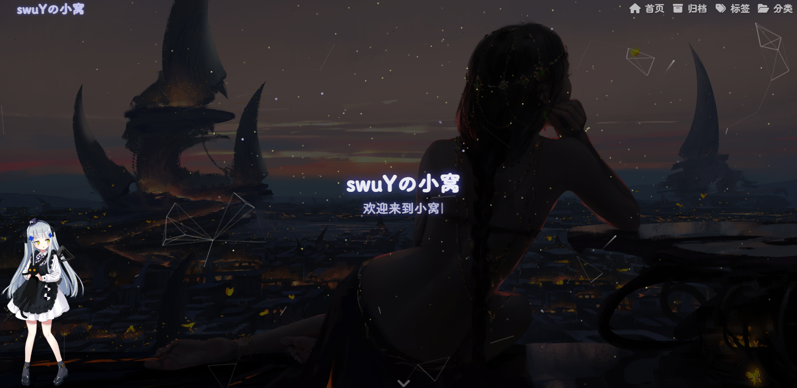
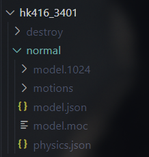
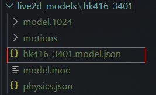

# Hexo 自定义 live2d 看板娘 

**首先呢这里有我找到的一些看板娘模型: https://github.com/swuY34/Live2D_Models.git (可直接使用 `Git` Clone整个项目 或者 使用 `SVN` 将单个模型下载单个模型).**

## 效果预览:

<center></center>

## 具体步骤:

### 安装

在Hexo根目录 `[BlogRoot]` 下打开终端, 输入以下命令安装helper-live2d插件:

```bash
npm install --save hexo-helper-live2d
```

### 导入自定义模型

> 跟其他大佬一样这里就用这个少女前线的 `"hk416_3401"` 来演示, 因为这个抱着黑猫的太可爱了哈哈;

1. 首先在Hexo根目录新建 `live2d_models` 文件夹
2. 将模型文件放进 `live2d_models` 文件夹
3. 重命名模型文件中的 `json` 文件

<font size=3>原模型文件</font>



> 真正需要的是 `normal` 下的那些东西, 所以可以直接复制normal文件夹到 `live2d_models` 文件夹下.

之后将 `normal` 文件夹重命名, 然后重命名 `normal` 文件夹下的 `normal\model.json` 文件



> 将 `json` 文件的文件名改成和文件夹同名 `{文件夹名}.model.json` 就行啦.

### 配置

在 Hexo 根目录的 `[BlogRoot]\_config.yml` 配置文件中添加配置

```yaml
# Live2D
## https://github.com/EYHN/hexo-helper-live2d
live2d:
  enable: true #开关插件版看板娘
  scriptFrom: local # 默认
  pluginRootPath: live2dw/ # 插件在站点上的根目录(相对路径)
  pluginJsPath: lib/ # 脚本文件相对与插件根目录路径
  pluginModelPath: assets/ # 模型文件相对与插件根目录路径
  # scriptFrom: jsdelivr # jsdelivr CDN
  # scriptFrom: unpkg # unpkg CDN
  # scriptFrom: https://npm.elemecdn.com/live2d-widget@3.x/lib/L2Dwidget.min.js # 你的自定义 url
  tagMode: false # 标签模式, 是否仅替换 live2d tag标签而非插入到所有页面中
  debug: false # 调试, 是否在控制台输出日志
  model:
    use: hk416_3401 # use: wanko # 博客根目录/live2d_models/ 下的目录名
    # npm-module package name
    # use: ./wives/wanko # 相对于博客根目录的路径
    # use: https://npm.elemecdn.com/live2d-widget-model-wanko@1.0.5/assets/wanko.model.json # 你的自定义 url
  display:
    position: left #控制看板娘位置
    width: 250 #控制看板娘大小
    height: 500 #控制看板娘大小
    hOffset: -40 #水平偏移
    vOffset: -70 #垂直偏移
  # mobile:
  #   show: true # 手机端是否显示
  #   scale: 0.5 # 模型与canvas的缩放
  # react:
  #   opacity: 0.7 # 透明度
```

<font size=3>更多参数配置可以自行查看官方 API 文档: https://l2dwidget.js.org/docs/class/src/index.js~L2Dwidget.html#instance-method-init</font>

## 运行

```bash
hexo clean
hexo g
hexo s
```

之后就可以在 `localhost:4000` 查看效果了.

## 卸载看板娘

```bash
npm uninstall hexo-helper-live2d # 卸载看板娘插件
# 看板娘模型直接手动删除就行啦
```

卸载之后为了保证配置不出错, 记得把 `[BlogRoot]\_config.yml` 里的 `live2D` 配置项注释掉或者删掉.
